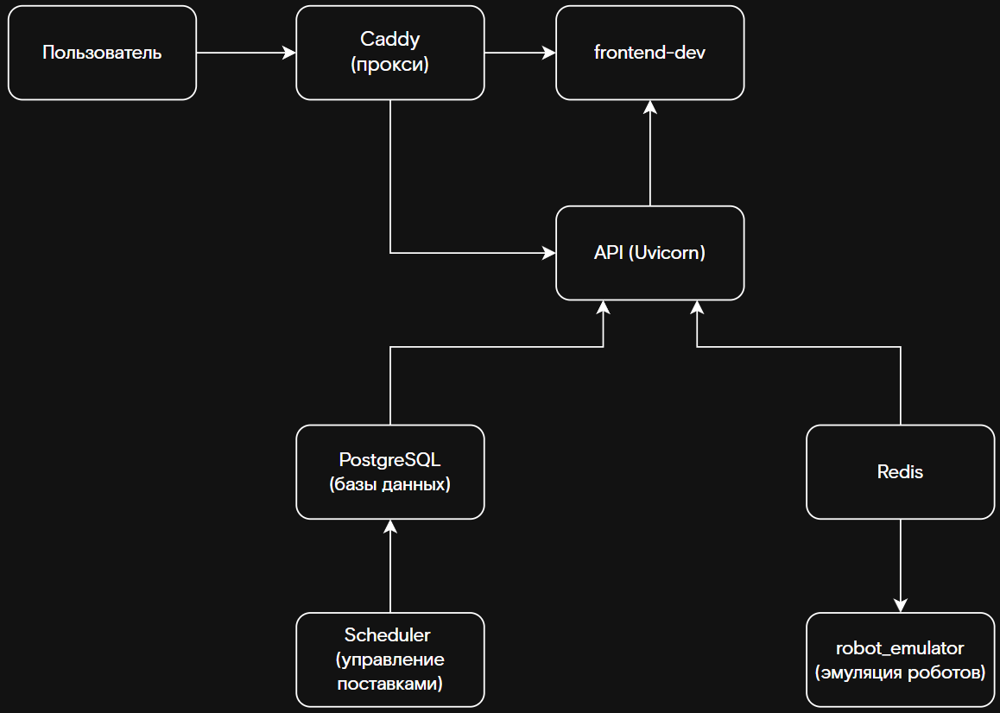

  

<h1 align="center">Rostelecom Smart Warehouse</h1>

  <i>"Умный склад - система управления
складской логистикой с использованием автономных
роботов"</i>  

---

## 🧭 О проекте

**Ростелеком Умный склад** — это решение для кейс-чемпионата "Расти в ИТ".  
Проект направлен на автоматизацию и повышение эффективности управления складом с использованием **RTK-технологий, анализа данных** и **AI-моделей** для прогнозирования и оптимизации логистических процессов. 
[📂 Ссылка на кейс](https://drive.google.com/drive/u/0/folders/16xJ4XcN_ipFjO-VJEkBTMvxk1MhP9xqA)

Система объединяет **данные RTK-устройств**, **машинное обучение** и **умный интерфейс**, чтобы:
- 📦 Оптимизировать хранение и перемещение товаров  
- 🚜 Повысить точность позиционирования техники и персонала  
- 📊 Предсказывать загрузку и узкие места склада  
- ⚙️ Автоматизировать управленческие решения  

---

## 🏗 Архитектура проекта

  

**Компоненты проекта:**
1. **Backend** — API на FastAPI   
2. **Frontend** — React + TypeScript  
3. **AI Module** — прогнозирование и аналитика  
4. **Database** — PostgreSQL  
5. **Integration Layer** — обработка RTK-данных от внешних устройств  

---

## ⚙️ Технологический стек

| Категория | Технологии |
|------------|-------------|
| 💻 Frontend | React, TypeScript, Vite, shadcn/ui |
| ⚙️ Backend | FastAPI, SQLAlchemy |
| 🧠 Data & ML | Pandas, PyTorch |
| 🗄 Database | PostgreSQL, Redis, Keycloak |
| 🧰 DevOps | Docker, GitHub Actions, YandexCloud|

---

## 🧠 Команда проекта

| Участник | Роль | Контакты |
|-----------|------|-----------|
| Никита  | Backend Developer | [GitHub](https://github.com/nikBaben),[Telegram](@bab3n) |
| Матвей | Frontend Developer & UX/UI Designer | [GitHub](https://github.com/o2cloud) |
| Вадим | Frontend Developer | [GitHub](https://github.com/tailorsky) |
| Александр | Backend Developer | [GitHub](https://github.com/RikiTikiTavee17) |
| Захар | Backend Developer | [GitHub](https://github.com/ZaharPavlikov) |
| Евгений | Data Science Engineer | [GitHub](https://github.com/Mmm-max) |

---
